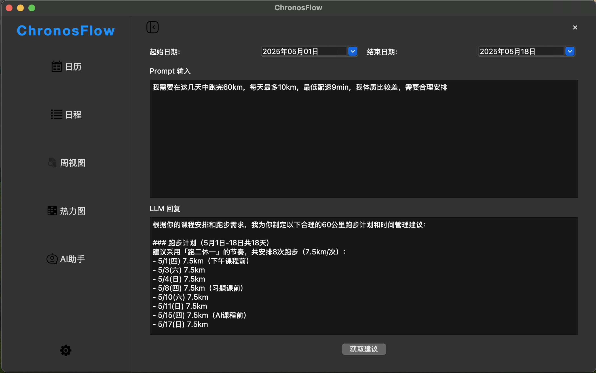

# 目录
- [程序开发准备与功能介绍](#程序开发准备与功能介绍)
  - [主要开发工具](#主要开发工具)
  - [版本控制与协作](#版本控制与协作)
    - [分支策略](#分支策略)
    - [commit规范](#commit规范)
  - [类似开源项目](#类似开源项目)
  - [核心功能](#核心功能)
  - [主要功能](#主要功能)
- [项目模块与类设计](#项目模块与类设计)
  - [run](#run) 
  - [main](#main)
  - [Event](#event)
  - [EventManager](#eventmanager)
  - [Notice](#notice)
  - [MainWindow](#mainwindow)
  - [Calendar](#calendar)
  - [Emitter](#emitter)
  - [CreateEventWindow](#createeventwindowschedule)
  - [Settings](#settings)
  - [SideBar](#siderbar)
  - [common](#common)
  - [SignalConnect](#signalconnect)
  - [Tray](#tray)
  - [FloatingWindow](#floatingwindow)
  - [course_importer](#course_importer)
  - [AIChat](#aichat)
  - [页面设计](#页面设计)
- [小组成员分工情况](#小组成员分工情况)
- [项目总结与反思](#项目总结与反思)


# 程序开发准备与功能介绍

## 主要开发工具
Python3.10,
[sqlite3](https://docs.python.org/3/library/sqlite3.html),
[PySide6](https://doc.qt.io/qtforpython-6/index.html)(>=6.72),
...\
**具体要求详见[requirements.txt](https://github.com/cskyliner/ChronosFlow/blob/main/requirements.txt)**

## 版本控制与协作
**[本项目GitHub网址](https://github.com/cskyliner/ChronosFlow)**

### 分支策略
`main`(稳定版) + `docs`(更新开发文档) + `userX/*`(开发分支)

### commit规范
```
<标签>: <简洁描述>
```
可参考[conventional commits](https://www.conventionalcommits.org/en/v1.0.0/)
|标签|含义|
|---|----|
|fix| 修改bug|
|feat| 添加功能|
|docs| 修改文档|
|style| 格式调整|
|refactor|重构代码（无功能影响）|
## 类似开源项目：
往年程设：\
[MindfulMeadow](https://github.com/MindfulMeadow-Dev-Team/MindfulMeadow),
[MindFlow](https://github.com/Oscarhouhyk/MindFlow),
[Qt_taskorganizer](https://github.com/MethierAdde/Qt_taskorganizer)\
开源项目：\
[Beaverhabits](https://github.com/daya0576/beaverhabits),
[Reminders](https://github.com/remindersdevs/Reminders?tab=readme-ov-file)
## 核心功能：
	日程管理，时间记录，任务规划

## 主要功能：
1. **分级日历纵览**：\
分级展示日程\

2. **音频提示，视觉提示**：\
通过任务栏小托盘实现快速操作，连接系统通知实现原生体验的日程提醒。
3. **Upcoming**：\
一次获取10个日程，并展示；翻到底部自动更新\

4. **不同类型的事件安排**：\
对Event采取不同分类：\
DDL直接使用截止日期和提前通知；\
日程（Activity）则为长期打卡任务或长时任务段，实现重复提醒操作
5. **课表**：\
支持excel导入（北京大学春秋季课表已经过验证），尽可能减少手动操作\

6. **快速检索**：\
根据日期、标题或tag准确搜索，词语之间留有空格可支持多关键词搜索。
7. **数据统计与可视化处理**：
年度热力图直观显示活动密度\

8. **AI日程规划助手**：
根据用户本地数据，调用LLM进行日程规划

# 项目模块与类设计
## run：
项目运行入口
## main：
实现主窗口的创建、信号连接(SignalConnect)、读取logging配置及检测系统类型进行适配
## Event: 
设置不同事件类：
*Activity（日程）*、*DDL（截止日期）*...
## EventManager：
管理事件:\
EventFactory(增删改事件)\
对SQL库进行操作:
+ 搜索事件（关键词或时间范围）
+ 对接前端
+ 回传数据
## Notice:
QSystemTrayIcon（Qt 托盘通知）任务栏：
处理UI设计，通知管理，菜单弹出设计\
plyer.notification（通用桌面通知）：
任务临近提醒，窗口弹出，后端对接\
保存通知信息，连接系统时间，按时发送信号给托盘和悬浮窗
## MainWindow: 
主窗口类\
存储多个主窗口样式(stack)
## Calendar:
月分级日历展示
使用QGraphicsRectItem组建绘制日历格子，双击后到该日的事件页面，shift键加单击可以多选
## CreateEventWindow（Schedule）：
负责创建事件，可更改事件类型，与事件的起止时间等，填写事件标题与内容
## Emitter：
用于发送信号，不同信号用不同的函数发射\
**统一实例化**：
为了便于信号发射接收的统一，设置单独实例化
，每次调用emitter时候，只需要```Emitter.instance().函数名.connect/emit()```\
具体信号作用详见注释
## Settings:
设置窗口
+ 本地存储地址设置
+ 壁纸设置
+ 导入课程表的相关变量设置（课表本地位置与开学日期等）
## SiderBar:
侧边栏类\
实现多页面切换
## Upcoming:
即将到来的DDL：
按照时间轴排序，提供修改入口，可以快速删除或标记已完成
## common:
打包导入的库，避免每次import大量库，直接
```from common import *```即可
## SignalConnect:
初始化前后端信号连接
## Tray
托盘类\
实现系统托盘，程序初始化会在系统任务栏产生一个图标\
通过右键图标能够回到主页面，显示悬浮窗，以及彻底退出应用\
## FloatingWindow
悬浮窗类\
最小化主窗口会产生悬浮窗，通过悬浮窗按钮能够\
回到主页面，隐藏悬浮窗，彻底退出应用\
悬浮窗支持显示最近一次DDL倒计时
## course_importer
导入课表逻辑，借用pandas处理excel文件，通过正则表达式适配PKU春秋季课表，后续对于更广泛课表的支持有待更新
## AIChat
实现了ai日程规划助手，通过结合用户的需求和起止日期之间的日程和DDL，借助用户在设置中提供APIKEY选择的LLM来规划日程，目前仅支持deepseek的openai接口，其他LLM有待更新支持
## 页面美化
[qss](https://doc.qt.io/qtforpython-6/tutorials/basictutorial/widgetstyling.html#tutorial-widgetstyling)(类似前端css)自定义qtUI格式\
**图标与背景图案设计**:
支持导入自定义背景、借用开源的svg和png图案作为图标统一放在assets中管理、支持深浅系统主题适应（每次更改需要重启）

# 小组成员分工情况

**刘昕泽**：主题背景，创建事件界面，DDL列表设计，搜索栏设计，总页面美化

**王思明**：系统托盘，通知提醒，悬浮窗，设置界面，周视图界面

**左若麟**：事件类设计，后端数据处理，日历界面设计，热力图界面设计，课表导入，AI助手支持

# 项目总结与反思

本项目受Thing3等日程管理软件启发，源于组员在日常学习中对 DDL 管理的迫切需求，而日常免费工具中普遍缺乏对北大课表导入与日程管理功能的兼容支持，因此我们希望开发一款**专为PKUer设计的免费开源日程管理软件**，以“实用、简洁、可视、便捷”为核心设计理念。\
由于Python丰富第三方库支持和高效开发能力，我们小组最后决定选择Python作为开发语言，采用PySide6进行界面UI设计。作为大一学生，小组成员均为首次尝试GitHub协作开发，尽管遭遇了代码冲突、分支管理和版本控制等诸多挑战，但我们也逐步掌握了开源协作的规范与工作流程\
当然由于时间、能力所限，项目依然存在许多不足。有一些功能，比如日记，任务规划等没能实现。界面设计也尚显简陋，未能打磨精细，仍有较大提升空间。不过在开发过程中，我们发现了团队协作相比于个人开发的优势，通过向LLM的虚心请教和与bug的斗智斗勇，我们对于复杂结构与逻辑有了更好的把握能力，而且对于这种后端数据存储加前端可视展示的程序有了更深入的了解。\
我们欢迎用户与开发者通过 Issue 提出反馈与建议，以助力项目不断完善、持续进化。
