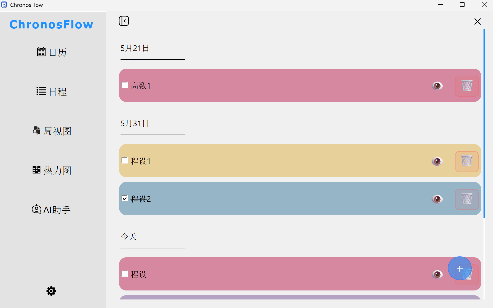
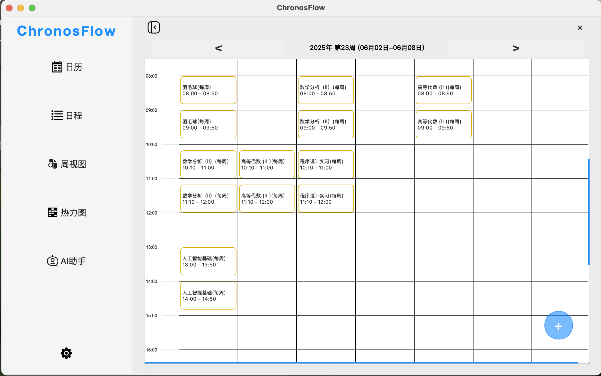
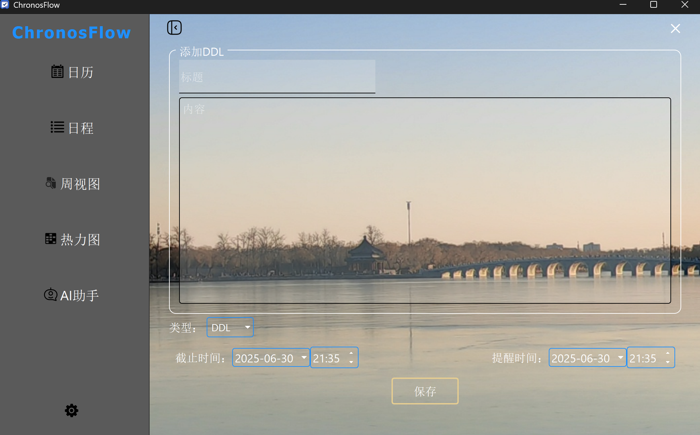

# 项目报告

## 目录

- [程序开发准备与功能介绍](#程序开发准备与功能介绍)
  - [主要开发工具](#主要开发工具)
  - [版本控制与协作](#版本控制与协作)
    - [分支策略](#分支策略)
    - [commit规范](#commit规范)
  - [核心功能](#核心功能)
  - [主要功能](#主要功能)
- [项目模块与类设计](#项目模块与类设计)
  - [run:项目入口](#run)
  - [main:初始化](#main)
  - [Event:事件类管理](#event)
  - [EventManager:后端数据处理](#eventmanager)
  - [Notice:通知](#notice)
  - [MainWindow:主窗口](#mainwindow)
  - [Calendar:日历](#calendar)
  - [Emitter:信号枢纽](#emitter)
  - [CreateEventWindow:新建事件](#createeventwindowschedule)
  - [Settings:设置](#settings)
  - [SideBar:侧边栏](#siderbar)
  - [common:库总结](#common)
  - [SignalConnect:信号初始化连接](#signalconnect)
  - [Tray:程序托盘](#tray)
  - [FloatingWindow:系统悬浮窗](#floatingwindow)
  - [course_importer:导入课表](#course_importer)
  - [AIChat:AI助手](#aichat)
  - [页面美化](#页面美化)
- [小组成员分工情况](#小组成员分工情况)
- [项目总结与反思](#项目总结与反思)

## 程序开发准备与功能介绍

### 主要开发工具

Python3.10,
[sqlite3](https://docs.python.org/3/library/sqlite3.html),
[PySide6](https://doc.qt.io/qtforpython-6/index.html)(>=6.72),
...\
**具体要求详见[requirements.txt](https://github.com/cskyliner/ChronosFlow/blob/main/requirements.txt)**

### 版本控制与协作

**[本项目GitHub网址](https://github.com/cskyliner/ChronosFlow)**

#### 分支策略

`main`(稳定版) + `docs`(更新开发文档) + `userX/*`(开发分支)

#### commit规范

```bash
<标签>: <简洁描述>
```

可参考[conventional commits](https://www.conventionalcommits.org/en/v1.0.0/)

|标签|含义|
|---|----|
|fix| 修改bug|
|feat| 添加功能|
|docs| 修改文档|
|style| 格式调整|
|refactor|重构代码（无功能影响）|

### 核心功能

  日程管理，时间记录，任务规划

### 主要功能

1. **分级日历纵览**：

分级展示日程


可以通过右上角搜索框搜索日程


2. **音频提示，视觉提示**：

通过任务栏小托盘实现快速操作，连接系统通知实现原生体验的日程提醒。  


3. **Upcoming**：

一次获取10个日程，并展示；翻到底部自动更新  
可以查看具体DDL、删除DDL、标记DDL已完成  

  


4. **不同类型的事件安排**：

对Event采取不同分类：
DDL直接使用截止日期和提前通知；
日程（Activity）则为长期打卡任务或长时任务段，实现重复提醒操作
创建DDL，可选截止日期及提醒时间

  

创建日程，可选起止日期、是否重复  
不重复：

  
  
重复：  


支持excel导入（北京大学春秋季课表已经过验证），尽可能减少手动操作，导入课程表时候会提取期末考试时间和上课地点等信息到日程备注中(即北大选课平台导出课程表的excel文件格式)(目前仅支持此格式，未来有待扩展)\
鼠标放到某个日程上方，会显示删除按钮；点击日程，可以具体查看  

  


6. **快速检索**：  

根据日期、标题准确搜索，可支持多关键词搜索：将不同关键词之间加空格即可。

7. **数据统计与可视化处理**：  

年度热力图直观显示活动密度  


8. **AI日程规划助手**：  

根据用户本地数据，调用LLM进行日程规划  


9. **设置**：  

可以指定设置的数据的存储目录、选择壁纸、输入密钥、导入课表  

  

使用专用窗口选择路径  


壁纸效果



## 项目模块与类设计

### run

项目运行入口

### main

实现主窗口的创建、信号连接(SignalConnect)、读取logging配置及检测系统类型进行适配

### Event

从BaseEvent出发设置不同事件子类：
*Activity（日程）*、*DDL（截止日期）*...

### EventManager

管理事件:\
EventFactory(增删改事件)\
对SQLite存储的数据进行操作:

- 搜索查找事件（关键词或时间范围）
- 接收前端命令
- 回传数据到前端

### Notice

QSystemTrayIcon（Qt 托盘通知）实现任务栏\
plyer.notification实现通用桌面通知（这里因为macOS和Windows的差别，macOS使用的pync进行系统通知）\
做到了保存通知信息，连接系统时间，按时发送信号给托盘和悬浮窗，任务临近提醒，系统通知窗口弹出

### MainWindow

主窗口类\
存储多个主窗口样式(stack)，初始化各个设置

### Calendar

月分级日历展示
使用QGraphicsRectItem组建绘制日历格子，双击后到该日的事件页面，shift键加单击可以多选

### CreateEventWindow（Schedule）

负责创建事件，可更改事件类型，与事件的起止时间等，填写事件标题与内容

## Emitter

用于发送信号，不同信号用不同的函数发射\
**统一实例化**：
为了便于信号发射接收的统一，设置单独实例化
，每次调用emitter时候，只需要```Emitter.instance().函数名.connect/emit()```\
具体各信号作用详见注释

### Settings

设置窗口

- 本地存储地址设置
- 壁纸设置
- API密钥设置
- 导入课程表的相关变量设置（课表本地位置与开学日期等）

### SiderBar

侧边栏类\
实现日历、日程、周视图、热力图、AI助手、设置多页面切换

### Upcoming

即将到来的DDL：
按照时间轴排序，提供修改入口，可以快速查看、修改、删除或标记已完成

### common

打包导入的库，避免每次import大量库，直接
```from common import *```即可

### SignalConnect

初始化前后端信号连接

### Tray

托盘类\
实现系统托盘，程序初始化会在系统任务栏产生一个图标\
通过右键图标能够回到主页面，显示悬浮窗，以及彻底退出应用

### FloatingWindow

悬浮窗类\
最小化主窗口会产生悬浮窗，通过悬浮窗按钮能够\
回到主页面，隐藏悬浮窗，彻底退出应用\
悬浮窗支持显示最近一次DDL倒计时

### course_importer

导入课表逻辑，借用pandas处理excel文件，通过正则表达式适配PKU春秋季课表，后续对于更广泛课表的支持有待更新

### AIChat

实现了ai日程规划助手，通过结合用户的需求和调用后端起止日期之间的日程和DDL数据，借助用户在设置中提供APIKEY选择的LLM规划日程，目前仅支持deepseek的openai接口，我们留有设计空余，其他LLM有待更新支持

### 页面美化

[QSS](https://doc.qt.io/qtforpython-6/tutorials/basictutorial/widgetstyling.html#tutorial-widgetstyling)(类似前端CSS)自定义QtUI格式\
**图标与背景图案设计**:
支持导入自定义背景、svg和png图案作为图标统一放在assets中管理、支持深浅系统主题适应（每次更改需要重启）

## 小组成员分工情况

| 成员 | 负责 |
|---|---|
|[James-Relu](https://github.com/James-Relu)|MainWindow页面框架与页面切换，创建事件界面，日程界面，日历界面搜索栏，各页面美化，系统深、浅主题适配，壁纸添加|
|[Uo-sm](https://github.com/Uo-sm)|系统托盘，通知提醒，悬浮窗，设置界面、周视图界面设计|
|[cskyliner](https://github.com/cskyliner)|事件类设计，后端数据处理以及前后端信号链接，日历、热力图界面框架实现，课表导入，AI助手|

## 项目总结与反思

本项目受[Things](https://culturedcode.com/things/)等日程管理软件启发，也源于我们组内成员在日常学习中对DDL管理的迫切需求。而日常市场免费工具中难以兼容北大课表导入与个性化日程管理，因此我们希望开发一款**专为PKUer设计的免费开源日程管理软件**，以“**实用、简洁、可视、便捷**”为核心设计理念。\
考虑到Python丰富第三方库支持和高效开发能力，我们小组决定选择**Python**作为开发语言，采用**PySide6**进行界面UI设计。作为大一学生，小组成员均为首次尝试GitHub多人协作开发，尽管遭遇了**代码冲突、分支管理、commit规范、环境冲突和版本控制**等诸多挑战，但我们也逐步掌握了规范的协作流程与开源实践方法。\
当然由于时间、能力所限，项目依然存在许多不足。部分功能(如**日记、任务分级规划、tag和重要程度的应用**)尚未实现；由于基于PySide，界面设计也尚显简陋，缺乏对视觉美学的统一打磨以及动画设计优化；早期开发阶段对Git的和前后端衔接部分理解不足导致进展较慢，而设计重心又过于注重实际和复现，缺少创新性与独特性，后续陆续添加了一些新功能，但是由于时间仓促，新功能的完善程度还不高，同时多个功能之间的协同有待提高；由于缺乏跨平台打包经验，目前尚未实现完整的图形化安装包发布，**仅支持通过终端运行**。\
在开发过程中，我们发现了团队协作的优势。通过**前后端分离设计**，**组件式开发**，**明确分工定期PR**，实现了“1+1+1>3”的效果；在向LLM的虚心请教和与bug的斗智斗勇的过程中，尤其是开发调用系统通知进行即时提醒和后台运行的模块时，我们对于复杂结构与逻辑有了更好的把握能力，并且对于这种后端数据存储加前端可视展示的程序有了更深入的了解；我们也对**SQLite本地存储结构、pandas数据处理、QSS样式美化、Qt信号槽机制**等技术有了了解。\
未来我们计划继续优化主题，打磨界面交互体验，强化功能协同性并探索引入更多AI能力，同时也欢迎用户与开发者通过**Issue**和**PR**提出反馈与建议，以助力项目不断完善、迭代优化。
