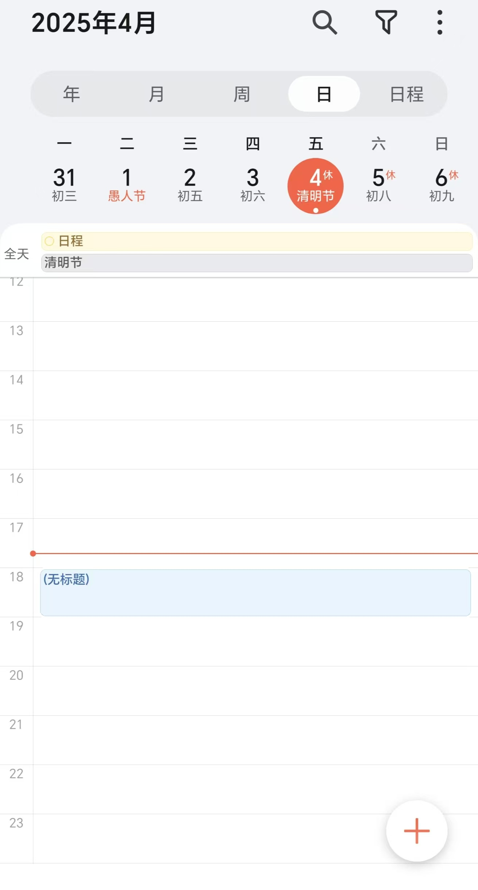
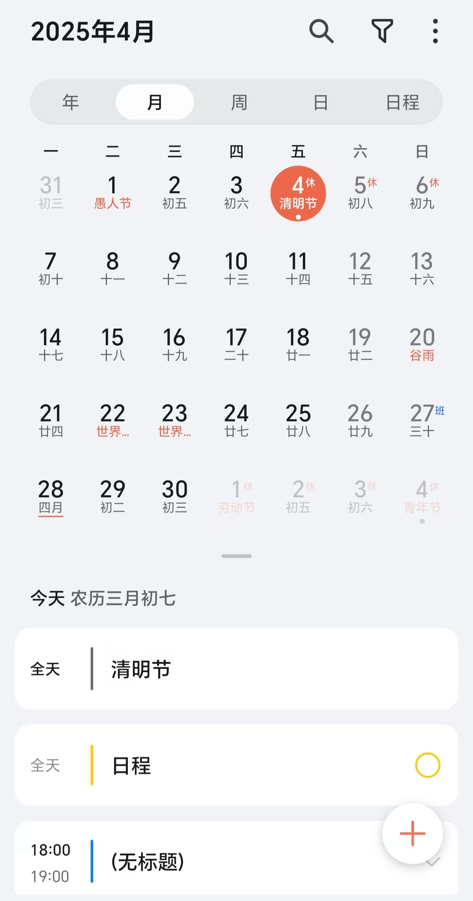
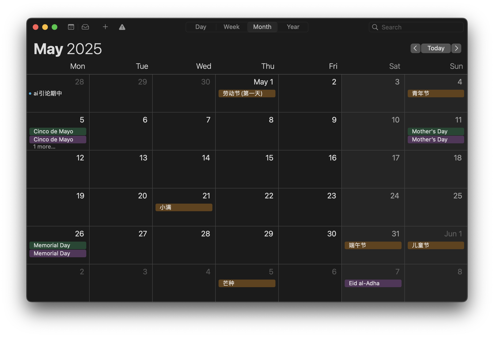
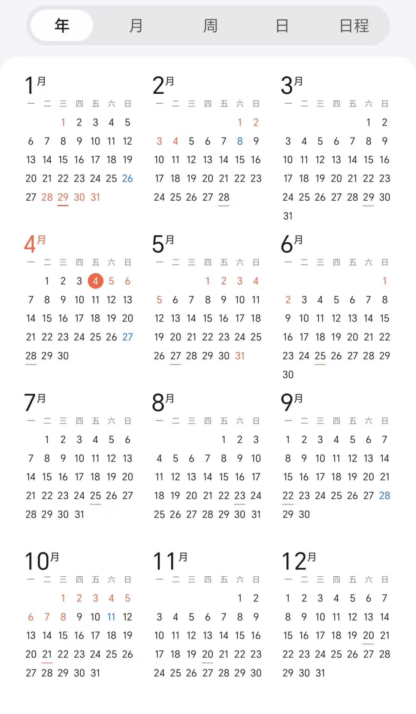

# project Untitled
- [Preparation](#preparation)
  - [Python Essential](#python-essential)
  - [版本控制与协作](#版本控制与协作)
    - [分支策略](#分支策略)
    - [工作流程](#工作流程)
    - [commit规范](#commit规范)
  - [类似开源项目](#类似开源项目)
  - [核心功能](#核心功能)
  - [主要功能](#主要功能)
- [文件及class功能设计](#文件及class功能设计)
  - [main](#main)
  - [Event](#event)
  - [Data](#data)
  - [Notice](#notice)
  - [MainWindow](#mainwindow)
  - [Calendar](#calendar)
  - [Emitter](#emitter)
  - [CreateEventWindow](#createeventwindowschedule)
  - [CreateDailyWindow](#createdailywindow)
  - [FindWindow](#findwindow)
  - [Settings](#settings)
  - [SideBar](#siderbar)
  - [common](#common)
  - [SignalConnect](#signalconnect)
- [页面设计](#页面设计)
- [性能优化](#性能优化)


# Preparation

## Python Essential:
conda\
Python3.10\
[sqlite3](https://docs.python.org/3/library/sqlite3.html)\
[PySide6](https://doc.qt.io/qtforpython-6/index.html)(>=6.72)\
[PEP 8 代码风格规范](https://peps.python.org/pep-0008/)\
...

## 版本控制与协作
[本项目GitHub网址](https://github.com/cskyliner/ChronosFlow)
### 分支策略
`main`(稳定版) + `docs`(更新开发文档) + `userX/*`(开发分支)
### 工作流程
1. 获取某分支新代码
```
git checkout branchX
git pull origin branchX
```
2. 同步main进度
```
git checkout userX
git fetch origin
git merge origin/main
```
**如果出现冲突，处理冲突后重新提交一次**
```
git add .
git commit 
```
**尽量不要merge其他user的分支，这样会导致git记录混乱**
3. 进行开发 → 提交更改 → 推送到远程
```
git add .
git commit -m "feat: 添加xxx功能"
git push origin userX
```
4. 通过 Pull Request 提交合并请求，合并到main分支：
+ 填写清晰的标题与描述
+ 选择合并方式：Squash and merge
+ 修改提交信息，给出本次提交实现功能和修改bug的简要描述

### commit规范
```
<标签>: <简洁描述>
```
可参考[conventional commits](https://www.conventionalcommits.org/en/v1.0.0/)
|标签|含义|
|---|----|
|fix| 修改bug|
|feat| 添加功能|
|docs| 修改文档|
|style| 格式调整|
|refactor|重构代码（无功能影响）|
## 类似开源项目：
往年程设：\
[MindfulMeadow](https://github.com/MindfulMeadow-Dev-Team/MindfulMeadow),
[MindFlow](https://github.com/Oscarhouhyk/MindFlow),
[Qt_taskorganizer](https://github.com/MethierAdde/Qt_taskorganizer)\
开源项目：\
[Beaverhabits](https://github.com/daya0576/beaverhabits)
[Reminders](https://github.com/remindersdevs/Reminders?tab=readme-ov-file)
## 核心功能：
	日程管理，时间记录，任务规划

## 主要功能：
1. **分级日历纵览**：\
分级展示日程\
day:\
\
week:\
\
month:\
\
or\
\
year(maybe):\
\

2. **音频提示，视觉提示**：\
通过任务栏小托盘实现快速操作，连接系统通知实现原生体验的日程提醒。
3. **Upcoming**：\
临近日程根据优先级显示
4. **给出小建议，安排空闲时间**：\
以用户自定义任务紧急程度，与其他参数加权计算紧急程度。较远目标：（智能型任务助手）
5. **分级式的日程安排**：\
对Event采取不同分类：\
DDL直接使用截止日期和提前通知；\
Task则使用树状管理，每个节点都作为Task类型，使用markdown格式，而叶则采用checklist，检查是否存在子任务来自动决定是否为最小事件\
Clock则为长期打卡任务，实现重复提醒操作
6. 日记功能：\
支持markdown格式，文本本地储存，允许用户自定义地址
7. 课表：\
支持excel导入，尽可能减少手动操作
8. 快速检索：\
根据日期、标题或tag准确搜索，加入对内容的模糊搜索。
9. 数据统计与可视化处理：
周总结，热度图直观显示每日安排
10. 模板化：\
针对北京大学，提供一种or多种**特色**预制模板形式，以供快速布置任务安排or进行每日记录
...
# 文件及class功能设计
## main：
主文件，项目入口\
实现了主窗口的创建\
实现了信号连接即SignalConnect\
实现了读取logging配置\
实现了检测系统类型\
## Event: 
事件日程基类，连接前后端\
也许可以根据事件类型划分子类：
*Task（短期日程）*，*Activity（公共活动）*,*Clocks（长期打卡）*,*DDL（截止日期）*...\
函数接口：\
创建事件
EventFactory.create(事件类型，事件标题)\
增删改事件:
event.add_event(),event.delete_event(),event.modify_event()\
搜索事件：
search_all(keywords:str)(全局搜索)
对接前端：
recieve_signal(object)
接受输入的元组，提取第一项表示前端命令，后面代表相应参数
TODO:回传给前端数据
## Notice:
TODO:
QSystemTrayIcon（Qt 托盘通知）任务栏：
处理UI设计，通知管理，菜单弹出设计\
plyer.notification（通用桌面通知）：
任务临近提醒，窗口弹出，后端对接
## MainWindow: 
主窗口类\
存储多个主窗口样式
包含一个侧边栏
TODO：支持多种主题样式
## Calendar:
日历显示类\
月分级为主要窗口
使用Qt自带QCalendarWidget组件实现了以月单位的日历，~~支持基本的右键添加操作菜单~~，左键单击后到专门的添加日程页面\
TODO： 日，周，年的处理。（拖拽实现多选）。 日历中快速添加日程，解析自然语言时间。和创建日程窗口连接。
“联动操作”，点击月分级中的日方块，跳转到日窗口之类的人性化快捷操作。
## CreateEventWindow（Schedule）：
有Schedule类，创建日程窗口\
 TODO：添加调整当前日期时间的功能
通过save_text向后端发送路径、日期、主题、内容，TODO:通过load_text加载内容\
和Event类实现前后端对接\
实现了对接后端创建DDL事件 
TODO:选择创建多种事件
## Emitter：
用于发送信号，不同信号用不同的函数发射\
**统一实例化**：
为了便于信号发射接收的统一，设置单独实例化
，每次调用emitter时候，只需要```Emitter.instance().函数名.connect/emit()```就可以了，**是否有必要多次实例化有待讨论**\
 send_dynamic_signal发射**元组**\
 send_create_event发射**元组(object)**，第一项为"create_event"表示**命令**，后续为创建event参数\
 send_search_all_event发射**元组(object)**，第一项为"search_all"表示**命令**，后续为搜索关键词tuple[str]\
 send_search_columns_event发射**元组(object)**，第一项为"search_columns"表示**命令**，后续为搜索列名tuple[str]+搜索关键词tuple[str]\
 其余前端窗口信号格式均为若干个纯字符串
## CreateDailyWindow：
TODO:创建日记窗口：\
记录日记，实现markdown渲染
## FindWindow：
TODO:检索结果
## Settings:
TODO:设置窗口\
具体类别：
本地存储地址设置
通知设置
## SiderBar:
侧边栏类\
实现多种功能切换,提供搜索栏入口\
要想再向sidebar中添加新按钮，只需在存储按钮名字的元组中添加新页面的名字，即可创建好一个向MainWindow发射的新信号,接下来只需要在MainWindow中创建对应页面即可
## Upcoming:
即将到来的日程：
按照时间轴排序，同时支持拖拽快速修改日程
## common:
打包导入的库，避免每次import大量库，直接
```from common import *```即可
## SignalConnect:
初始化前后端连接

...

# 页面设计
**Tools**:[qss](https://doc.qt.io/qtforpython-6/tutorials/basictutorial/widgetstyling.html#tutorial-widgetstyling)(类似前端css)自定义qtUI格式\
**操作动画**：QPropertyAnimation\
**图标与背景图案设计**:
日历的背景图案，设置否需要单独一个图标而不是放在侧边栏，
创建事件窗口的美化，日历不会随着窗口缩放而缩放

# 性能优化
多线程、异步操作保证页面流畅…
<!--stackedit_data:
eyJoaXN0b3J5IjpbLTExMzUxNDEwMDEsLTEwMzMyODg2MDBdfQ
==
-->