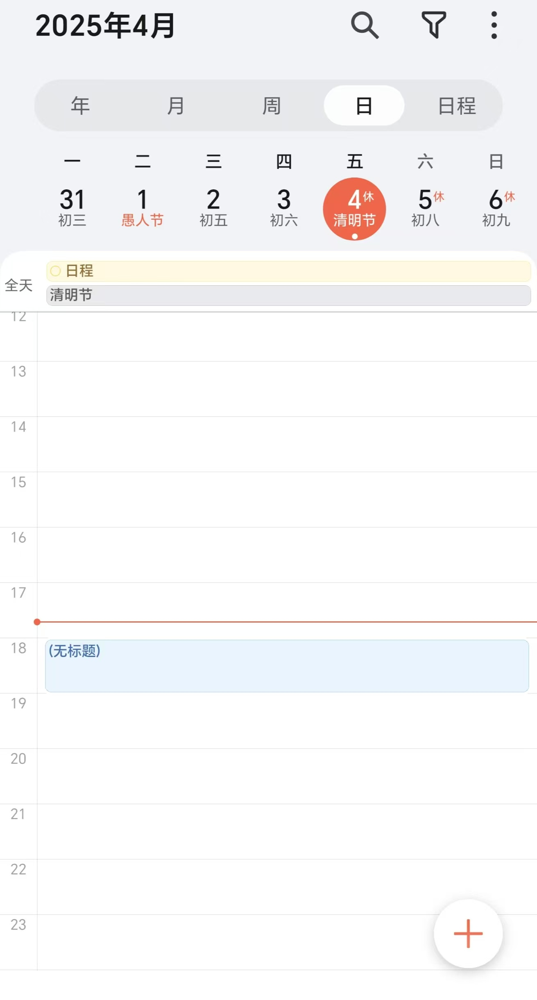
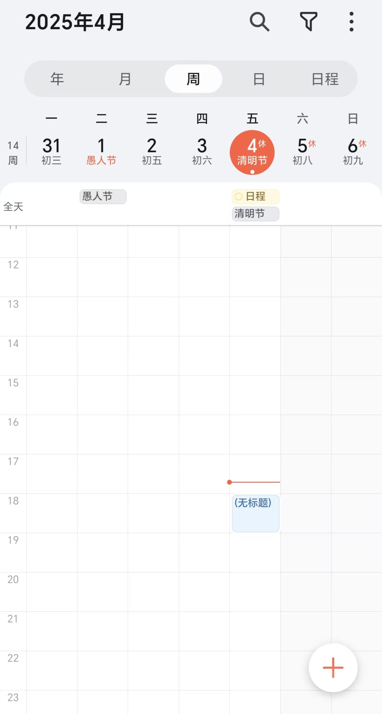
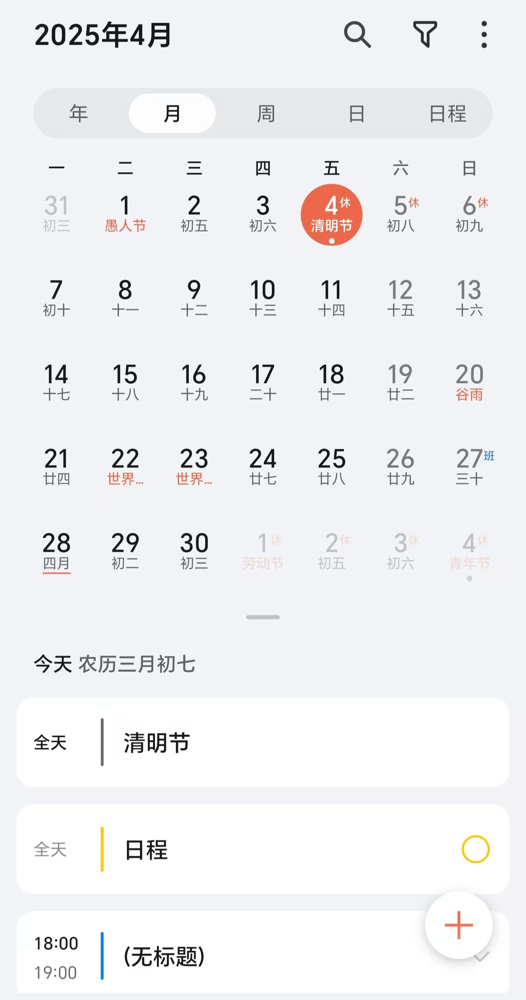
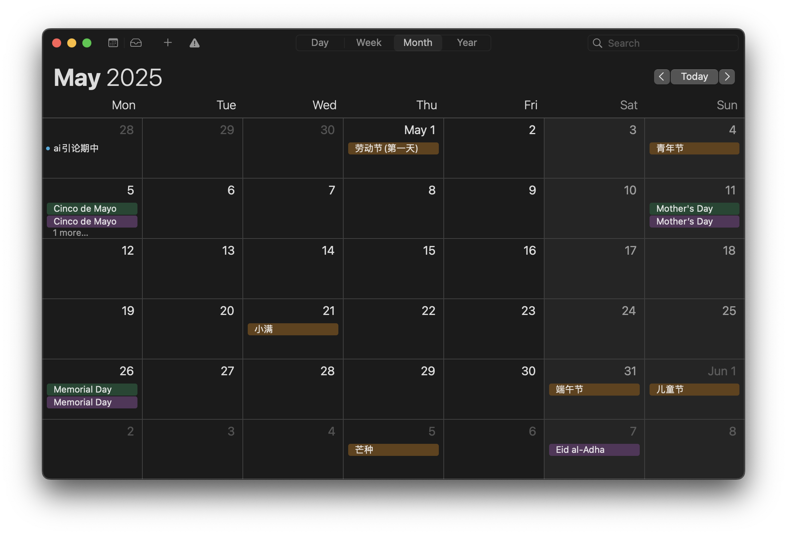
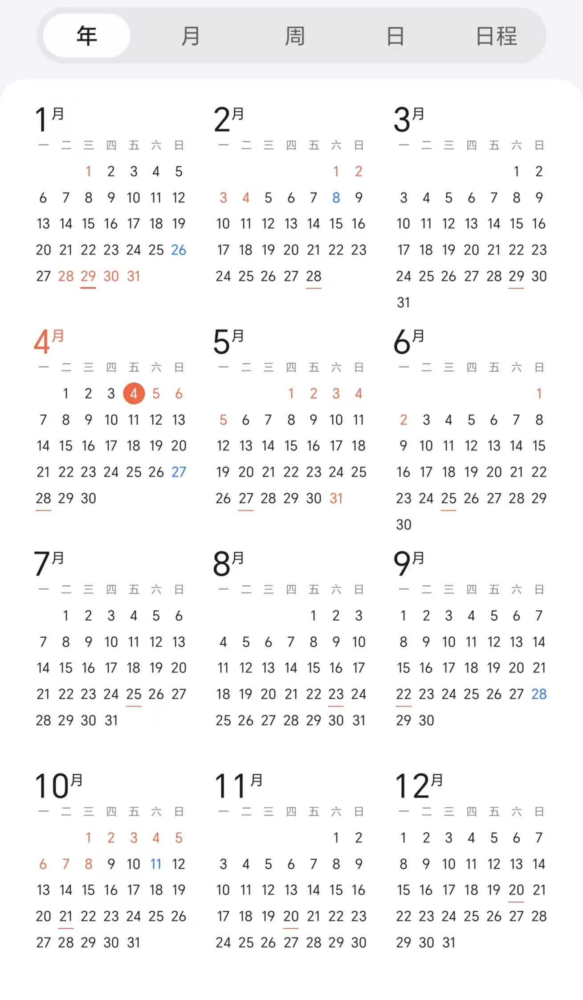

# project Untitled

## Python Essential:
conda\
Python3.10\
[PySide6](https://doc.qt.io/qtforpython-6/index.html)\
[PEP 8 代码风格规范](https://peps.python.org/pep-0008/)\
...
## 界面美化设计：

	QtDesigner,QSS...

## 版本控制与协作
	git,github...
## 类似开源项目：
往年程设：\
[MindfulMeadow](https://github.com/MindfulMeadow-Dev-Team/MindfulMeadow),
[MindFlow](https://github.com/Oscarhouhyk/MindFlow),
[Qt_taskorganizer](https://github.com/MethierAdde/Qt_taskorganizer)\
开源项目：\
[beaverhabits](https://github.com/daya0576/beaverhabits)
## 核心功能：
	日程管理，时间记录

## 主要功能（待选）：
1. 选择日期界面：\
day week month year 切换 使用Qt自带QCalendarWidget组件显示基本月历\
分级展示日程形式\
day:\
\
week:\
\
month:\
\
or\
\
year(maybe):\
\
热度图？

2. 音频提示，视觉提示：\
QSystemTrayIcon（Qt 托盘通知）任务栏：
UI设计，通知管理，菜单弹出设计\
plyer.notification（通用桌面通知）：
任务临近提醒，窗口弹出，后端对接

3. Upcoming：\
临近日程推荐排序？

4. 文件管理器式的日程安排：\
类似文件夹，大事件套小事件。可能需要类似递归的操作？此处可能需要一些技术处理

5. 日记功能：\
支持markdown渲染，需要进一步研究，是否实时预览?文本本地储存位置？如何允许用户自行设置地址

6. 课表：\
如何支持excel导入，尽可能减少手动操作

7. 给出小建议，安排空闲时间：\
往届多以用户自定义任务紧急程度，与其他参数加权计算紧急程度。是否可以接入大语言模型API？或是根据Kaggle训练集预先训练好评估函数？

8. 快速检索：\
根据日期、标题或者内容。检索速度？模糊检索？加tag？

9. 数据统计与可视化处理：

10.  数据库存储读取:\
MySQL,json格式（ ~~是否需要服务器存储~~ 纯本地读写）

11. *模板化：\
针对北京大学，提供一种or多种**特色**预制模板形式以供快速布置任务安排or进行每日记录？

12. *活动信息获取：\
利用python爬虫优势从北大官网获取活动信息并写入日历？北大官网也提供了API接口(https://isop.pku.edu.cn/svcpub/index_pub.html)，可行性未知（**难度未知**）

13. 用户个性化（profile）：
14. 对鼠标动作的捕捉:\
不同位置左右键点击的触发任务设置。

...
## Class设计

~~### DayBlock：
以日为单位设置日历？储存日程？~~
### Event: 
事件日程基类\
也许可以根据事件类型划分子类：
*Task（短期任务）*，*Activity（公共活动）*,*Clocks（长期打卡）*...
### MainWindow: 
主窗口类\
侧边栏功能对应不同主窗口，两种实现方法?
1. 多个主页面，复制一种侧边栏sidebar
2. 一个主页面，切换不同页面形式，以一个MainWindow为母类，下存储多个主窗口样式
### Calendar:
日历显示类\
已经实现了基本月单位的日历，支持基本的右键添加操作菜单\
TODO：日，周，（年）的处理
### CreateEventWindow：
创建日程窗口？
### CreateDailyWindow：
创建日记窗口？
### FindWindow：
检索结果
### SiderBar:
侧边栏类
实现多种功能切换\
FIXME:似乎对于Dark模式的支持不好
...

## 页面设计
动画:\
拖拽?过渡?\
风格：\
简洁？\
tools:\
[qss](https://doc.qt.io/qtforpython-6/tutorials/basictutorial/widgetstyling.html#tutorial-widgetstyling)(类似前端css)自定义qtUI格式\
图标与背景图案设计:

## 性能表现优化
多线程、异步操作保证页面流畅…
<!--stackedit_data:
eyJoaXN0b3J5IjpbLTExMzUxNDEwMDEsLTEwMzMyODg2MDBdfQ
==
-->